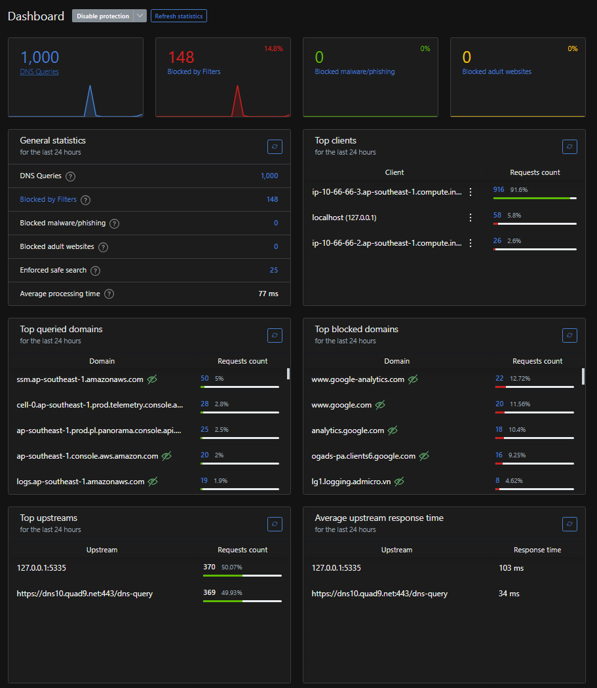
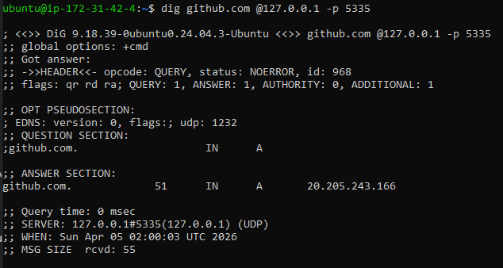

# Cloud-Native Secure VPN Gateway & DNS Sinkhole

A comprehensive, privacy-first VPN Gateway built on AWS EC2. This project integrates **WireGuard**, **AdGuard Home**, and **Unbound** to provide an encrypted tunnel, enterprise-grade ad/malware blocking, and a self-hosted recursive DNS resolver to completely eliminate third-party DNS tracking.

**Author:** Pham Thanh Lam | Network Security Student @ University of Information Technology (UIT)

---

## 🏗️ System Architecture & Packet Flow

The system is designed with a strict, closed-loop packet flow to ensure zero DNS leaks and maximum privacy:

`Client Device` ➔ `[Encrypted Tunnel]` ➔ `WireGuard (AWS EC2)` ➔ `AdGuard Home (Port 53)` ➔ `Unbound (Port 5335)` ➔ `Root Servers`

graph LR
    Client[📱 Client Device] -->|Encrypted Tunnel| WG[🛡️ WireGuard VPN]

    subgraph AWS EC2 (Ubuntu t3.micro)
        WG -->|DNS Queries 10.66.66.1:53| AGH[🛑 AdGuard Home DNS Sinkhole]
        AGH -.->|Blocked Trackers| Null[❌ 0.0.0.0]
        AGH -->|Clean Queries 127.0.0.1:5335| UB[🧠 Unbound Recursive Resolver]
    end

    UB -->|Direct Query DNSSEC Validated| Root[🌐 ICANN Root Servers]

1. **WireGuard:** Establishes a lightweight, state-of-the-art encrypted VPN tunnel from the client to the AWS cloud.
2. **AdGuard Home:** Acts as a DNS Sinkhole. It intercepts all DNS queries from the VPN interface (`10.66.66.1`), blocking telemetry, ads, and malicious domains using custom rule lists (e.g., OISD, ABPVN).
3. **Unbound:** A validating, recursive, and caching DNS resolver. Instead of forwarding clean queries to public DNS providers (like Google or Cloudflare), Unbound queries the ICANN Root Servers directly, ensuring complete privacy.

---

## 📈 Performance & Impact
* **DNS Resolution Latency:** Reduced to **< 5ms** for cached queries locally via Unbound, ensuring a seamless browsing experience without VPN lag.
* **Traffic Optimization:** Blocked approximately **25% of background telemetry and ad traffic**, saving bandwidth and significantly reducing page load times.
* **FinOps Efficiency:** Achieved **100% cost-efficiency** by orchestrating the entire stack within the AWS Free Tier limitations (1GB RAM, 1 vCPU), utilizing optimized blocklists (~240k rules) to prevent Out-Of-Memory (OOM) errors.

---

## ⚙️ Key Features & Configurations

* **Cloud Infrastructure (FinOps Optimized):** Deployed on an AWS `t3.micro` instance. Managed Elastic IPs and Security Groups to ensure the system operates entirely within the AWS Free Tier.
* **Port Conflict Resolution:** Overcame the default Ubuntu `systemd-resolved` port 53 conflict by safely modifying `resolved.conf.d` and re-linking the `resolv.conf` stub, allowing AdGuard Home to act as the primary local resolver.
* **Optimized Blocklists:** Configured with ~240,000 rules specifically chosen to balance maximum tracking prevention with the 1GB RAM limitation of the micro-instance to prevent Out-Of-Memory (OOM) crashes.
* **Enforced Safe Search:** Implemented strict DNS-level parental controls and SafeSearch enforcement for search engines.

---

## 🛠️ Challenges Resolved
* **Systemd-resolved Conflict:** Ubuntu's default DNS stub listener occupied Port 53, preventing AdGuard from starting. Resolved by creating a custom `resolved.conf.d` override to disable `DNSStubListener` and relinking `/etc/resolv.conf`, ensuring seamless DNS handoff.
* **Resource Constraints:** To prevent the 1GB RAM EC2 instance from crashing, carefully selected optimized blocklists (OISD Small & ABPVN) instead of massive multi-million rule lists, keeping memory footprint stable under 150MB.

---

## 📊 Dashboard & Performance Proof

*AdGuard Home effectively filtering traffic originating from the WireGuard tunnel.*

### Unbound Active Cache

By issuing two consecutive `dig` requests, we can prove the local recursive resolver is actively caching queries. Latency drops to 0ms.

### Client DNS Configuration

The client must be explicitly configured to use the internal VPN Gateway IP (`10.66.66.1`) as its sole DNS server.

---

## 🚀 Deployment Summary

* **OS:** Ubuntu 24.04 LTS (AWS EC2)
* **VPN:** WireGuard
* **DNS Filtering:** AdGuard Home (Listening on `10.66.66.1:53` and `127.0.0.1:53`)
* **Recursive DNS:** Unbound (Listening on `127.0.0.1:5335` with DNSSEC enforced)

*Note: This repository serves as documentation for the infrastructure deployed. For security reasons, actual configuration files containing private keys and Elastic IPs are not published.*
